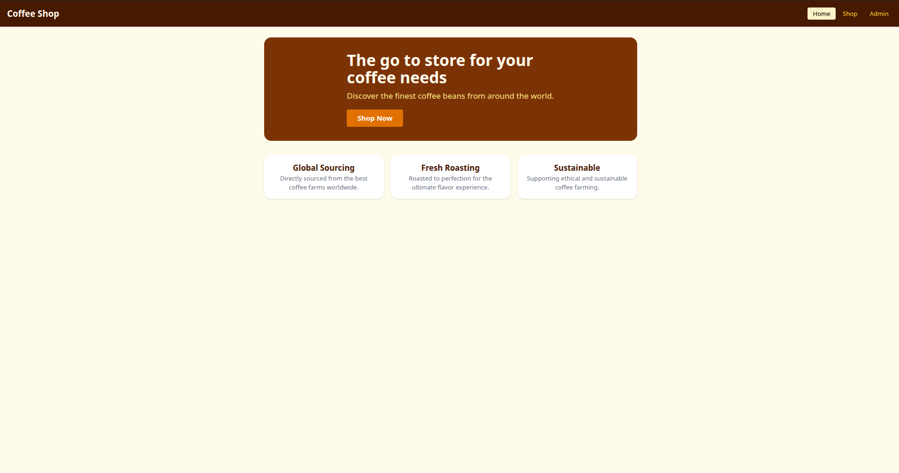
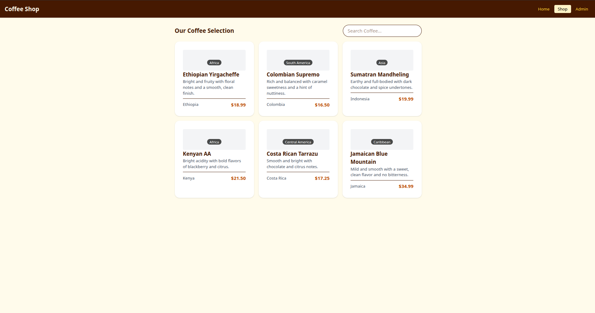
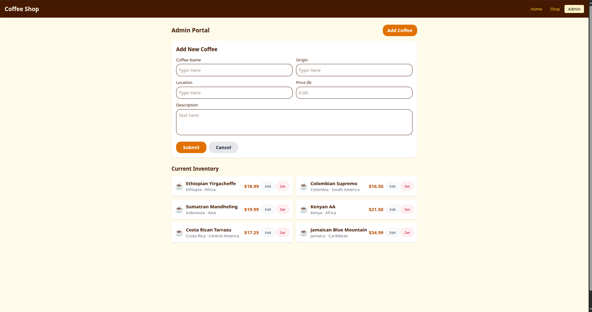

# Coffee Shop

A web application for managing a coffee shop inventory with CRUD operations

## Table of Contents

- [Features](#features)

- [Tech Stack](#tech-stack)

- [Local Setup](#local-setup)

- [Usage Guide](#usage-guide)

- [Testing](#testing)

- [Screenshots](#screenshots)

- [Contact](#contact)

- [License](#license)

## Features

1. Home Page - Landing page with hero section and feature highlights

2. Shop Page - Browse coffee products with search functionality

3. Admin Portal - Complete CRUD operations for coffee products:

- Add new coffee products

- Edit existing products

- Delete products

## Tech Stack

- Vite+React

- React Router v7

- Tailwind CSS

- JSON Server

## Local Setup

### Reequirements

- Node.js
- node package manager(npm)
- A modern web browser

### Installation

1. Clone the repository

```bash
git clone https://github.com/Victor-Mufasa/coffee-shop
```

2. Navigate into the coffee-shop folder

```bash
cd coffee-shop
```

3. Install dependencies

```bash
npm install
```

4. Start the json server

```bash
npm run server
```

5. Start the developments server

```bash
npm run dev
```

6. Open your browser

Visit <http://localhost:5173>

## Usage Guide

### Home Page

- Hero section with call-to-action

- Three feature cards (Global Sourcing, Fresh Roasting, Sustainable)

### Shop Page

- Search bar for filtering products

- Grid display of coffee products

- Product cards with name, description, origin and price

### Admin Page

- Add/Edit product form

- Inventory list with Edit and Delete buttons

- Form validation for required fields

### Search Functionality

- Search by product name

- Search by origin

- Search by description

- Real-time filtering as you type

## Testing

To test the application:

1. Ensure JSON Server is running (npm run server)

2. Run the development server (npm run dev)

3. Test all CRUD operations:

- Create a new product

- Edit existing products

- Delete products

- Search for products

## Screenshots







## Contact

For any feedback questions or improvements ideas feel free to reach out at:

<victorkipkemboi241@gmail.com> or
<rickvick142@gmail.com>

## License

Copyright &copy; 2026 Victor Kipkemboi

Permission is hereby granted, free of charge, to any person obtaining a copy of this software and associated documentation files (the "Software"), to deal in the Software without restriction, including without limitation the rights to use, copy, modify, merge, publish, distribute, sublicense, and/or sell copies of the Software, and to permit persons to whom the Software is furnished to do so, subject to the following conditions:

The above copyright notice and this permission notice shall be included in all copies or substantial portions of the Software.

THE SOFTWARE IS PROVIDED "AS IS", WITHOUT WARRANTY OF ANY KIND, EXPRESS OR IMPLIED, INCLUDING BUT NOT LIMITED TO THE WARRANTIES OF MERCHANTABILITY, FITNESS FOR A PARTICULAR PURPOSE AND NONINFRINGEMENT. IN NO EVENT SHALL THE AUTHORS OR COPYRIGHT HOLDERS BE LIABLE FOR ANY CLAIM, DAMAGES OR OTHER LIABILITY, WHETHER IN AN ACTION OF CONTRACT, TORT OR OTHERWISE, ARISING FROM, OUT OF OR IN CONNECTION WITH THE SOFTWARE OR THE USE OR OTHER DEALINGS IN THE SOFTWARE.